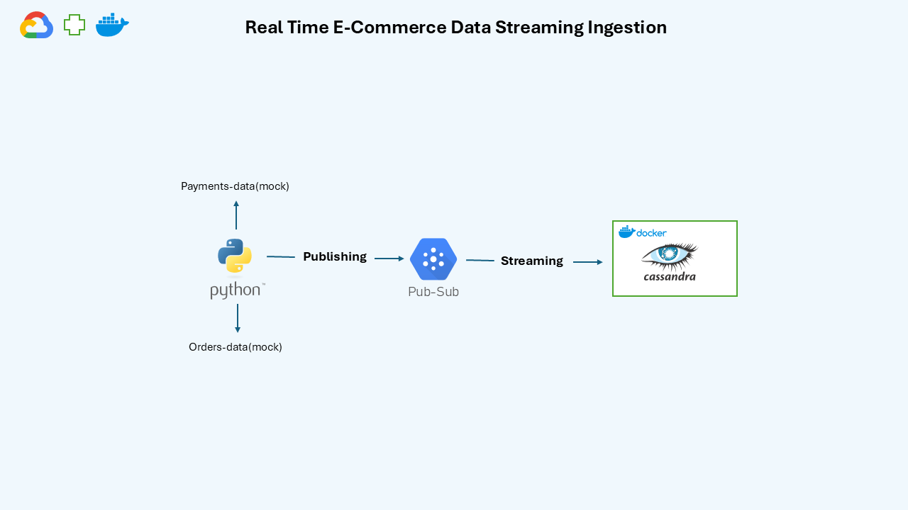

# Real-Time-E-Commerce-Data-Streaming-Ingestion

## Table of Contents
- [Introduction](#introduction)  
- [Tech Stack](#tech-stack)
- [System Architecture](#system-architecture)  
- [Implementation Process](#implementation-process)

---

## Introduction
This project showcases a real-time data streaming and ingestion pipeline designed for e-commerce applications. By simulating `order_data` and `payment_data`, it ingests, processes, and stores transactional data in a Cassandra NoSQL database using Google Cloud Pub/Sub, Python scripts, and Dockerized services.

To execute this project, ensure the following prerequisites are met:  

1. **Google Cloud Account**  
   - Set up Pub/Sub topics: `orders_data` and `payments_data`.  
   - Configure authentication using a Google Cloud service account key.  

2. **Python Environment**  
   - Install the required libraries:  
     ```bash
     pip install -r requirements.txt
     ```  

3. **Docker Installed**  
   - Install Docker and Docker Compose to run Cassandra in a containerized environment.  

4. **Cassandra Setup**  
   - Initialize the Cassandra database and create the table `orders_payments_facts` using the provided schema script.  

5. **Architecture Understanding**  
   - Review the [System Architecture](#system-architecture) for a high-level overview of the project flow.  

---  

## Tech Stack  

This project utilizes the following technologies:

- **Google Cloud Pub/Sub**: A messaging service for real-time data streaming between producers and consumers.
- **Python**: The main programming language for producing and consuming data, and for processing messages.
- **Apache Cassandra**: A highly scalable NoSQL database used for storing transactional data with low-latency reads and writes.
- **Docker**: Used to containerize Cassandra and ensure consistent deployment across different environments.

---
## System Architecture  

The system follows a real-time data streaming architecture using Google Cloud Pub/Sub for messaging and Cassandra for data storage. Data is produced in real-time and consumed by Python scripts. The processed data is then ingested into a Cassandra database. Any unmatched payment data is sent to a Dead Letter Queue (DLQ) for further handling.



---
## Implementation Process  

The implementation of this project is broken down into the following steps:

### 1. **Data Simulation**  
   - Mock `order_data` and `payment_data` are generated using Python scripts (`[orders_producer.py](order_data_producer.py)` and `[payments_producer.py](payments_data_producer.py)`). These scripts simulate real-world e-commerce transactions, such as order and payment details.
   - The `[orders_producer.py](order_data_producer.py)` script generates random order data (e.g., order ID, customer details) and publishes it to the `orders_data` Pub/Sub topic.
   - Similarly, the `[payments_producer.py](payments_data_producer.py)` generates payment data (e.g., payment ID, order ID, amount) and publishes it to the `payments_data` Pub/Sub topic.

### 2. **Pub/Sub Topics Setup**  
   - Two Pub/Sub topics are created in Google Cloud for real-time data streaming:
     - `orders_data`: Receives order-related data.
     - `payments_data`: Receives payment-related data.
   - These topics enable asynchronous communication between the producer and consumer scripts, facilitating the real-time ingestion and processing of data.

### 3. **Cassandra Setup**  
   - The Cassandra NoSQL database is set up in a Docker container using `[docker-compose-cassandra.yml](docker-compose-cassandra.yml)`. This file launches the Cassandra service.
   - The database schema is initialized using a script (`[cassandra-table-syntax](cassandra_table_syntax.txt)`), which creates the `orders_payments_facts` table to store the processed data. The table is designed to hold order and payment information, such as order ID, payment ID, and transaction details.

### 4. **Data Processing**  
   - **Consumer Scripts**:  
     - The `[order_consumer.py](order_data_consumer.py)` script listens to the `orders_data` Pub/Sub topic for incoming order data.
     - The `[payment_consumer.py](payment_consumer.py)` script listens to the `payments_data` Pub/Sub topic for incoming payment data.
   - Both consumer scripts use the Python `google-cloud-pubsub` library to pull messages from their respective topics and process them in real-time.
   - The consumer scripts extract relevant data from each message, parse it, and insert or update it in the `orders_payments_facts` table in Cassandra.

   If the order ID in the payment data exists in the `orders_payments_facts` table, the `[payment_consumer.py](payment_consumer.py)` script updates the existing record with the payment data, including payment ID, amount, and transaction details. 

   If the order ID does not exist in the Cassandra table, the script produces the payment data to the Dead Letter Queue (DLQ) Pub/Sub topic. This ensures that unmatched payment data is handled separately and can be investigated further.


### 5. **Error Handling & DLQ**  
   - If the `[payment_consumer.py](payment_consumer.py)` script encounters payment data that does not match any existing order ID, the unmatched data is redirected to a DLQ for further investigation.
   - The DLQ mechanism ensures that no payment data is lost and that any discrepancies can be handled later.
   
### 6. **Execution Order**  
   - The scripts are executed in the following order for the system to work correctly:
     1. **Start Cassandra**: Run the Docker container for Cassandra using the following command:
        ```bash
        docker-compose up
        ```
     2. **Produce Order and Payment Data**: Run `[orders_producer.py](order_data_producer.py)` and `[payments_producer.py](payments_data_producer.py)` to generate and push data to the respective Pub/Sub topics.
     3. **Consume Data**: Run `[order_consumer.py](order_data_consumer.py)` and `[payment_consumer.py](payment_consumer.py)` to consume the data from Pub/Sub and update the Cassandra table.
     4. **Handle DLQ**: If any unmatched payment data is detected,handle the data from dql-data pub-sub topic.

You can find all the relevant scripts and configuration files in the respective directories.

- **Scripts**:  
   - [orders_producer.py](order_data_producer.py)  
   - [payments_producer.py](payments_data_producer.py)  
   - [order_consumer.py](order_data_consumer.py)  
   - [payment_consumer.py](payment_consumer.py)

- **Cassandra Setup**:  
   - [docker-compose.yml](docker-compose-cassandra.yml)  
   - [cassandra-table-syntax](cassandra_table_syntax.txt)


